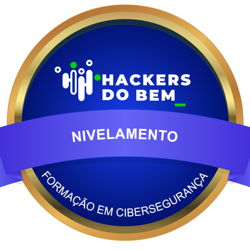
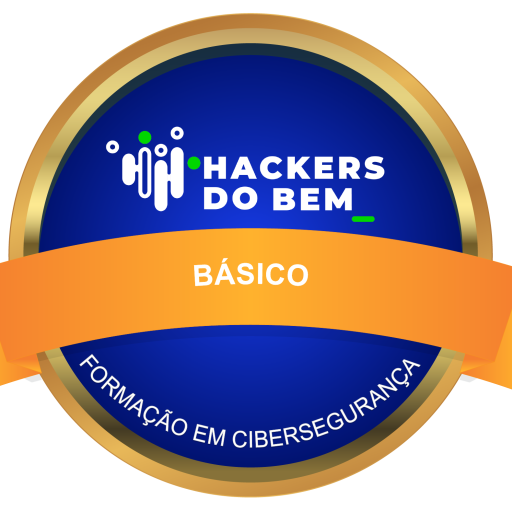

🌪️ Oi, eu sou a May!

### < CodeMayPy /> Desenvolvedora em forma de furacão 💻⚡

> *"Eu não vim do zero. Vim do caos. E transformei em coragem."*

---
🛡️ Formação Hacker & Cibersegurança

Orgulhosamente progredindo na trilha do Hackers do Bem:

<div align="center">   </div>

---

## 📊 Minha atividade


🧠 Habilidades em Expansão:

💻 Linguagens e Tecnologias
🛠️ Ferramentas & Infra <br> <br> <br>


📚Atualmente:<br> 

🎓 Cursando: **2º Semestre de Análise e Desenvolvimento de Sistemas**<br>
🛡️ Modo **Grimoire Hacker** ativado: me aprofundando em Redes, DNS, IPs, Firewalls e TCP/IP.<br>
💡 **TDAH** Friendly: meus projetos são feitos por blocos, com intenção e paixão.


## 💬 Contato & Redes

[](https://linkedin.com/in/code-maypy)
[](https://instagram.com/code.maypy)

Se quiser trocar ideia sobre tech, cibersegurança, ou só mandar um meme — tô por aqui.

---

## ✨ Sobre mim em código:
```python
class May:
    def __init__(self):
        self.nome = "Mayara"
        self.apelido = "May / CodeMayPy"
        self.fase = "Renascimento - 2º Semestre ADS "
        self.missao = "Hackear sistemas e a vida, com ética e coragem."

    def estudar(self):
        return ["Python", "Java", "Web Dev", "Cibersegurança"]

    def sonhar(self):
        return "Fazer da tecnologia minha liberdade"
```


---

### Obrigada por visitar meu cantinho no GitHub 🌻
Se quiser me acompanhar nessa jornada hacker-poética-tech, bora juntos!
```


# Code.Maypy 🐍✨

Descrição simples com mais linhas, listas, informações sobre o projeto:

- Projeto de estudos em Python, Desenvolvimento Web e Java;
- Quanto tempo de evolução;
- Como executar;
- Tecnologias usadas.

Feito com 💜 e ☕ por @CodeMayPy


