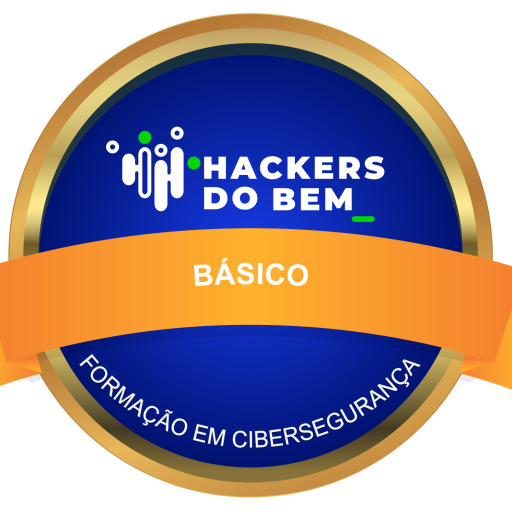
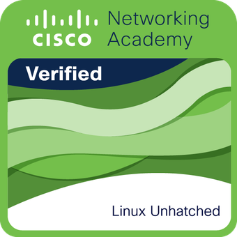

🌪️ Oi, eu sou a May!

### < CodeMayPy /> Desenvolvedora em forma de furacão 💻⚡

> *"Eu não vim do zero. Vim do caos. E transformei em coragem."*
 

##  Minha atividade: 


💻 **Linguagens e Tecnologias:**
<br>

Onde o caos se transforma em lógica:

 `Python` | `Java` | `Sql` | `HTML5/CSS3`


🛠️ **Ferramentas & Infra:**

Equipamentos do meu arsenal hacker e de desenvolvimento.

 `Linux (Terminal)` | `Cisco Networking` | `Git` | `Docker/VMs` | `Google Cloud`

<br>

## 📚Atualmente:<br> 

Cursando: **2º Semestre de Análise e Desenvolvimento de Sistemas**<br>
Modo **Grimoire Hacker** ativado: me aprofundando em Redes, DNS, IPs, Firewalls e TCP/IP.<br>
**TDAH** Friendly: meus projetos são feitos por blocos, com intenção e paixão.

<br>


## ✨ Sobre mim em código:
```python
class May:
    def __init__(self):
        self.nome = "Mayara"
        self.apelido = "May / CodeMayPy"
        self.fase = "Renascimento - 2º Semestre ADS "
        self.missao = "Hackear sistemas e a vida, com ética e coragem."

    def estudar(self):
        return ["Python", "Java", "Web Dev", "Cibersegurança"]

    def sonhar(self):
        return "Fazer da tecnologia minha liberdade"
```
<br>

---

<br>

# 🏆 Badges & Marcos de Jornada:
Aqui estão os marcos da minha evolução em Cibersegurança, Redes e Infraestrutura:

### 🛡️ Hackers do Bem:

> *Progredindo na trilha de formação.*
<div style="text-align: center;">
   
</div>


### 🌐 Google Cloud & IA: 

> *Badge conquistada no evento oficial.*
<div style="text-align: center;">
  
</div>


### 🐧 Linux & 🔌 Cisco Networking:

> *Fundamentos de sistemas e conectividade.*
<div style="text-align: center;">
  
</div>

## 💬 Contato & Redes

[](https://linkedin.com/in/code-maypy)
[](https://instagram.com/code.maypy)

Se quiser trocar ideia sobre tech, cibersegurança, ou só mandar um meme — tô por aqui.

---

### Obrigada por visitar meu cantinho no GitHub 🌻
Se quiser me acompanhar nessa jornada hacker-poética-tech, bora juntos!

```
Feito com 💜 e ☕ por @CodeMayPy
```

---
<br>


